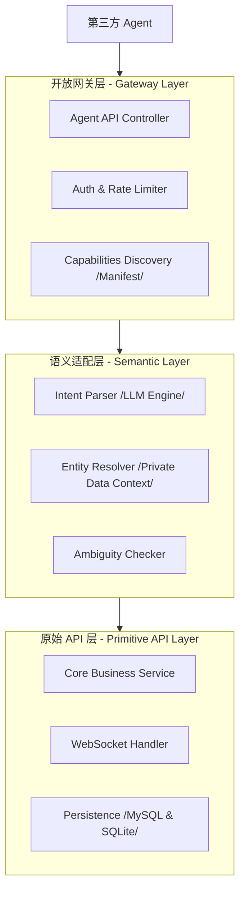

# 灵信 (LinXin) 架构设计文档 (MVP)

## 1. 总体设计
系统的核心架构设计旨在实现**自动化与安全性的平衡**。通过分层设计，确保第三方智能体 (Agent) 能够通过语义化的方式执行操作，同时严格保护用户隐私数据。

### 1.1 三层架构模型

---

## 2. 关键组件说明

### 2.1 开放网关层 (Gateway Layer)
- **职责**：处理 Agent 接入认证 (JWT)、请求频率限制、接口版本控制。
- **能力暴露**：动态生成并返回 `Manifest`，描述系统当前支持的所有 AI 工具及其调用参数。

### 2.2 语义适配层 (Semantic Layer) - **核心大脑**
- **LLM 意图解析**：将自然语言指令转换为具体的 `ToolCall`（如 `send_message`）。
- **实体检索 (Private Entity Retrieval)**：
    - 使用用户的**备注名、昵称、常用联系人、关系标签**作为向量或关键词索引。
    - **安全特性**：检索逻辑在服务端本地运行，仅返回解析出的 `targetUserId` 给执行层，绝不向 Agent 返回完整的好友名单。
- **冲突处理**：如果检索到多个潜在目标，返回 `RESOLVE_CONFLICT` 指令给 Agent。

### 2.3 原始 API 层 (Primitive Layer)
- **原子性**：只处理带明确 ID 的请求（例如 `sendMsg(ID: 1001, content: "...")`）。
- **回写同步**：执行成功后，通过 WebSocket 向该用户的多端设备推送实时通知，实现多端一致性。

---

## 3. 核心流程流程设计

### 3.1 第三方 Agent 调用流程
1. **Agent 获取清单**：Agent GET `/api/agent/manifest`，了解可用功能。
2. **发送意图**：Agent POST `/api/agent/call`，Payload 为自然语言（如：“帮我给老婆发消息”）。
3. **语义解析 (Server)**：
    - 调用 LLM 解析出操作类型为 `send_message`。
    - 查数据库找到当前用户的“备注名=老婆”的联系人 ID 为 `12345`。
4. **执行与推送**：
    - 调用 `MessageService` 发送消息。
    - 服务端通过 WebSocket 给用户的移动端发送 `sync_message_event`。
5. **客户端同步**：移动端 App 收到 WebSocket 事件，自动调用 `refreshChats` 并将新消息存入本地 SQLite。

---

## 4. 多端同步与一致性机制

### 4.1 实时推送 (Hot Path)
- 使用 **WebSocket (Stomp/Native)** 实现。
- 保证 Agent 发起的“代发”操作能在毫秒级反映在用户 App 的屏幕上。

### 4.2 增量补课 (Cold Path)
- **版本号机制 (Sequence ID)**：每个用户的消息序列都有一个全局递增的 Sequence ID。
- **上线同步**：App 启动或断线重连后，向服务端请求 `sync_diff(lastSequenceId)`。
- **作用**：解决离线期间 Agent 发起操作导致的数据不同步问题。

---

## 5. 安全体系
1. **Token Scoping**：Agent Token 细分为不同权限级，最小化风险。
2. **隐私围栏 (Privacy Fence)**：所有的语义模糊匹配都在服务端密闭环境中完成，不向 Agent 输出除操作结果外的任何辅助信息。
3. **审计日志**：记录所有 Agent 的操作历史，供用户随时查看。
