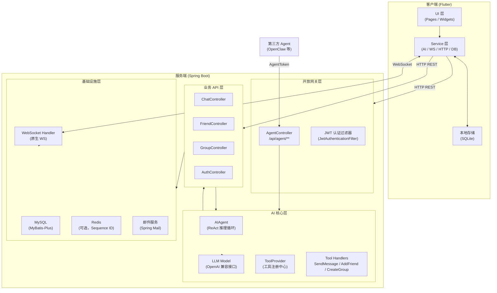
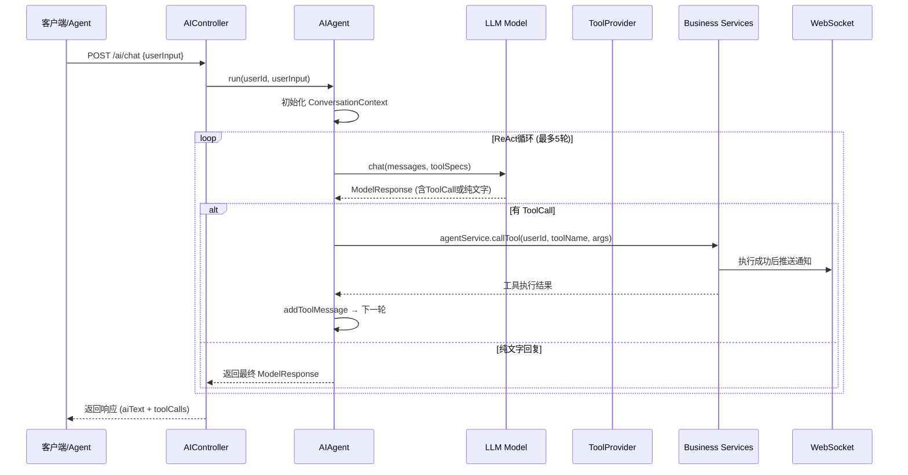
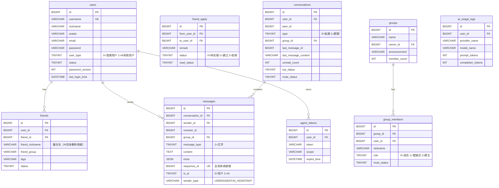

# 灵信 (LinXin) 技术架构文档

> 版本：v2.0 | 更新时间：2026-04-05

---

## 1. 总体架构

灵信采用**前后端分离**架构，客户端为跨平台移动应用，服务端为单体 Spring Boot 应用。系统的核心设计目标是在开放 AI 能力（Agent 接口）的同时，严格保护用户隐私。

### 1.1 系统分层架构



---

## 2. 服务端技术栈

### 2.1 核心框架

| 组件 | 技术选型 | 版本 | 用途 |
|------|---------|------|------|
| 应用框架 | Spring Boot | 3.4.2 | Web 服务、依赖注入、自动配置 |
| 安全框架 | Spring Security | 随 Boot | 接口鉴权、过滤链管理 |
| ORM | MyBatis-Plus | 3.5.10.1 | 数据库访问，含逻辑删除、分页 |
| 数据库 | MySQL | 8.x | 主要持久化存储 |
| 连接池 | Druid | 1.2.24 | 数据库连接池 + 监控 |
| 缓存 | Spring Data Redis | 随 Boot | Sequence ID 生成（可选） |
| 实时通信 | Spring WebSocket | 随 Boot | 原生 WebSocket 长连接 |
| 认证 | JJWT | 0.12.7 | JWT Token 签发与验证 |
| 文档 | SpringDoc + Knife4j | 2.3.0 / 4.5.0 | OpenAPI 文档与调试界面 |
| 对象转换 | MapStruct | 1.6.3 | Entity ↔ VO / DTO 转换 |
| 数据库迁移 | Flyway | 11.x | 版本化 DDL 管理 |
| 邮件 | Spring Mail | 随 Boot | 注册验证码邮件 |
| 日志 | Lombok `@Slf4j` + SLF4J | — | 结构化日志 |
| 代码规范 | Spotless (Eclipse 格式化) | 2.44.2 | 构建时自动格式化 |
| 测试覆盖率 | JaCoCo | 0.8.12 | 测试覆盖率报告 |
| Java 版本 | Java 17 | 17 | LTS 版本，支持 Records 等特性 |

### 2.2 服务端目录结构

```
linxin-server/src/main/java/org/linxin/server/
├── LinXinServerApplication.java        # 启动入口
├── ai/                                 # AI 模块
│   ├── controller/                     # AI HTTP 接口 (/ai/**)
│   ├── core/                           # AI 核心引擎
│   │   ├── agent/AIAgent.java          # ReAct 推理循环控制器
│   │   ├── context/ConversationContext # 对话上下文管理
│   │   ├── model/LLMModel              # LLM 接口抽象
│   │   └── tool/                       # 工具注册与定义
│   ├── handler/                        # 具体 Tool 执行器
│   │   ├── impl/SendMessageHandler     # 发送消息工具
│   │   ├── impl/AddFriendHandler       # 添加好友工具
│   │   └── impl/CreateGroupHandler     # 创建群组工具
│   ├── entity/                         # AI 相关数据实体
│   ├── mapper/                         # AI 数据访问层
│   └── service/                        # AI 业务服务
├── auth/                               # 认证鉴权模块
│   ├── AuthConfig.java                 # 认证配置
│   ├── JwtService.java                 # JWT 签发/验证
│   ├── JwtAuthenticationFilter.java    # JWT 请求过滤器
│   ├── SecurityConfig.java             # Spring Security 配置
│   └── DPUserDetailLoginService.java   # UserDetailsService 实现
├── business/                           # 核心业务模块
│   ├── controller/                     # REST API 控制器
│   │   ├── AgentController.java        # Agent 开放接口
│   │   ├── AuthController.java         # 注册/登录
│   │   ├── ChatController.java         # 消息/会话
│   │   ├── FriendController.java       # 好友管理
│   │   └── GroupController.java        # 群组管理
│   ├── service/                        # 业务服务接口与实现
│   │   ├── IChatService / impl/        # 消息、会话逻辑
│   │   ├── IFriendService / impl/      # 好友关系逻辑
│   │   ├── IGroupService / impl/       # 群组逻辑
│   │   ├── IUserService / impl/        # 用户逻辑
│   │   ├── IAgentService / impl/       # Agent 调用路由
│   │   └── IAgentTokenService / impl/  # Token 管理
│   ├── entity/                         # 数据库实体（MyBatis-Plus）
│   ├── mapper/                         # Mapper 接口
│   ├── vo/                             # 视图对象（返回给前端）
│   └── converter/                      # MapStruct 转换器
├── websocket/                          # WebSocket 模块
│   ├── WebSocketHandler.java           # 消息路由处理器
│   ├── WebSocketConfig.java            # WS 端点配置
│   ├── WebSocketInterceptor.java       # 连接鉴权拦截器
│   ├── IMessageBroker.java             # 消息推送抽象接口
│   ├── LocalMessageBroker.java         # 单机内存 Broker 实现
│   ├── IOfflineMessageService.java     # 离线消息接口
│   └── MysqlOfflineMessageService.java # 基于 MySQL 的离线消息实现
├── config/                             # 全局配置
├── common/                             # 公共工具（响应体、异常等）
└── util/                               # 工具类
```

---

## 3. 服务端核心设计

### 3.1 AI 推理引擎（ReAct Loop）



**已注册工具（Tools）：**
- `send_message` — 发送消息给指定联系人（支持 username/备注名模糊匹配）
- `add_friend` — 向指定用户发起好友申请
- `create_group` — 创建群组并邀请成员

### 3.2 WebSocket 消息路由

```
连接建立：ws://host:9099/lxa/ws
  → WebSocketInterceptor 验证 JWT Token
  → WebSocketHandler 将 session 注册到用户-连接映射表

消息类型路由：
  message         → 私聊消息
  group_message   → 群聊消息
  friend_apply    → 好友申请通知
  friend_handle   → 好友申请处理结果
  friend_delete   → 好友删除通知
  ping            → 心跳保活
```

### 3.3 消息 Sequence ID 机制

- 每条消息写入时分配全局单调递增的 `sequence_id`（由 Redis Snowflake 或数据库自增）
- 客户端维护本地 `lastSequenceId`
- 上线后通过 `GET /chat/sync?lastSequenceId={id}` 拉取离线期间所有消息
- 保证多端一致性与消息不丢失

### 3.4 认证鉴权体系

```
请求进入 → JwtAuthenticationFilter
  → 提取 Authorization: Bearer <token>
  → JwtService 验证签名 + 过期时间
  → 检查 password_version（防止密码变更后旧 Token 复用）
  → 注入 SecurityContext
  → 路由到对应 Controller
```

**Token 类型：**
- **UserToken**：用户登录后签发，标准 JWT，含 `userId`、`passwordVersion`
- **AgentToken**：用户在 App 内手动生成，含 `scope`（细粒度权限），存储于 `agent_tokens` 表

---

## 4. 客户端技术栈

### 4.1 框架与依赖

| 组件 | 技术选型 | 用途 |
|------|---------|------|
| 应用框架 | Flutter (Dart) | 跨平台 UI（iOS / Android / macOS / Web / Linux / Windows） |
| 状态管理 | Provider 6.x | 全局/局部状态共享与响应式 UI 更新 |
| HTTP 客户端 | Dio 5.x | REST API 调用、请求拦截器、Token 注入 |
| 本地数据库 | sqflite 2.x | SQLite 本地消息持久化 |
| 本地存储 | shared_preferences | Token、用户信息等轻量 KV 存储 |
| 实时通信 | dart:io WebSocket | 原生 WebSocket 长连接 |
| 日志 | logger 2.x | 分级日志（Debug/Info/Warning/Error） |
| 路径操作 | path + path_provider | 文件系统访问 |
| 测试 | flutter_test + mockito | 单元测试与 Mock |

### 4.2 客户端目录结构

```
linxin-client/lib/
├── main.dart                           # 应用入口，Provider 初始化
├── config/                             # 配置（API Base URL 等）
├── models/                             # 数据模型（与服务端对齐）
│   ├── user.dart
│   ├── chat.dart
│   ├── message.dart
│   ├── friend.dart
│   ├── group.dart
│   └── group_member.dart
├── services/                           # 服务层
│   ├── http_service.dart               # HTTP 客户端封装（Dio）
│   ├── auth_service.dart               # 登录/注册/Token 管理
│   ├── data_service.dart               # 全局数据状态（Provider）
│   ├── websocket_service.dart          # WebSocket 连接管理
│   ├── ai_service.dart                 # AI 接口调用
│   ├── ai_intent_service.dart          # AI 意图解析集成
│   ├── message_service.dart            # 消息发送封装
│   ├── message_local_service.dart      # 本地消息 SQLite 操作
│   ├── db_service.dart                 # SQLite 数据库初始化与 CRUD
│   ├── friend_service.dart             # 好友 API 调用
│   ├── group_service.dart              # 群组 API 调用
│   ├── event_bus.dart                  # 应用内事件总线
│   ├── log_service.dart                # 日志服务封装
│   ├── tool_executor.dart              # Tool 执行器接口
│   └── executors/                      # 具体 Tool 执行实现
│       ├── send_message_executor.dart  # 执行发消息操作
│       └── add_friend_executor.dart    # 执行加好友操作
├── pages/                              # 页面（路由级组件）
│   ├── main_page.dart                  # 主页（Tab 导航）
│   ├── login_page.dart
│   ├── register_page.dart
│   ├── chat_list_page.dart
│   ├── chat_detail_page.dart
│   ├── ai_chat_page.dart               # AI 对话页
│   ├── friend_list_page.dart
│   ├── friend_apply_list_page.dart
│   ├── user_search_result_page.dart
│   ├── user_details_page.dart
│   ├── create_group_page.dart
│   ├── group_settings_page.dart
│   ├── profile_page.dart
│   ├── edit_profile_page.dart
│   ├── account_security_page.dart
│   ├── agent_token_page.dart           # Agent Token 管理
│   ├── general_settings_page.dart
│   └── token_usage_page.dart
└── widgets/                            # 可复用 UI 组件
```

### 4.3 客户端分层设计

```
Page (UI)
  ↓ 调用
Service (业务逻辑)
  ↓ 调用
HttpService (REST) / WebSocketService (WS) / DbService (SQLite)
  ↓ 数据流
DataService (Provider 状态中心)
  ↓ notifyListeners()
Page (UI) 响应式刷新
```

---

## 5. 数据库设计

### 5.1 核心表结构



### 5.2 数据库迁移版本

| 版本 | 文件 | 内容 |
|------|------|------|
| V1.0.0.1 | `init.sql` | 初始化所有核心表，插入 AI 助手系统用户 |
| V1.0.0.2 | `add_message_status.sql` | 添加 `message_status` 表（消息已读状态） |
| V1.0.0.3 | `add_password_version.sql` | `users` 表添加 `password_version` 字段 |
| V1.0.0.4 | `add_tokens_and_verifications.sql` | 添加 `agent_tokens` 和邮箱验证码表 |

---

## 6. 接口设计

### 6.1 REST API 汇总

| 模块 | 方法 | 路径 | 说明 |
|------|------|------|------|
| 认证 | POST | `/auth/register` | 用户注册 |
| 认证 | POST | `/auth/login` | 用户登录，返回 JWT |
| 认证 | POST | `/auth/send-code` | 发送邮箱验证码 |
| 消息 | GET | `/chat/conversations` | 获取会话列表 |
| 消息 | GET | `/chat/messages` | 获取聊天历史 |
| 消息 | POST | `/chat/send` | 发送消息 |
| 消息 | GET | `/chat/sync` | 增量同步（`?lastSequenceId=`） |
| 好友 | GET | `/friend/list` | 好友列表 |
| 好友 | POST | `/friend/apply` | 发送好友申请 |
| 好友 | POST | `/friend/handle` | 处理好友申请 |
| 好友 | DELETE | `/friend/delete` | 删除好友 |
| 群组 | POST | `/group/create` | 创建群组 |
| 群组 | POST | `/group/invite` | 邀请成员 |
| 群组 | POST | `/group/remove` | 移除成员 |
| 群组 | DELETE | `/group/dismiss` | 解散群组 |
| AI | POST | `/ai/chat` | AI 对话（自然语言输入） |
| AI | POST | `/ai/execute` | 直接执行 ToolCall 列表 |
| AI | POST | `/ai/modify` | 修改 AI 识别的执行参数 |
| AI | GET | `/ai/tools` | 获取可用工具列表 |
| Agent | POST | `/api/agent/execute` | Agent 远程执行意图 |
| Agent | GET | `/api/agent/manifest` | 获取能力清单（规划中） |

### 6.2 WebSocket 消息格式

```json
// 服务端推送统一格式
{
  "type": "message | group_message | friend_apply | friend_handle | friend_delete",
  "data": { /* 具体业务数据 */ },
  "timestamp": 1712210000000
}

// 客户端发送格式
{
  "type": "message | ping",
  "data": {
    "content": "...",
    "conversationId": "...",
    "messageType": 1
  },
  "timestamp": 1712210000000
}
```

---

## 7. 安全设计

### 7.1 认证鉴权

- **用户认证**：JWT（HMAC-SHA256），Token 有效期可配置
- **密码安全**：BCrypt 哈希存储，`password_version` 防止旧 Token 使用
- **WebSocket 鉴权**：连接握手阶段由 `WebSocketInterceptor` 验证 JWT

### 7.2 Agent 安全隔离

```
隐私围栏原则：
  - 语义解析（自然语言 → userId）全程在服务端完成
  - Agent 接口不返回完整通讯录，仅返回操作结果
  - 歧义时返回 REQUIRE_CLARIFICATION（脱敏选项，无真实 ID）

Token Scope 细粒度控制：
  - msg:send        — 发送消息权限
  - contact:resolve — 语义解析联系人权限
  - （更多 Scope 随功能扩展）

操作溯源：
  - Agent 发出的所有消息 sender_type='AGENT'
  - UI 层对 Agent 消息进行特殊视觉标注
```

### 7.3 接口保护

- **频率限制**：Agent 接口 60 次/分钟
- **Spring Security**：白名单路径（`/auth/**`）放行，其余强制鉴权
- **AOP**：可扩展请求日志与操作审计

---

## 8. 部署配置

### 8.1 服务端配置项

```yaml
# application.yml 关键配置
spring:
  datasource:              # MySQL 数据源（Druid）
  data.redis:              # Redis（Sequence ID，可选）
  mail:                    # 邮件服务（注册验证码）
  flyway:                  # 数据库迁移（自动执行）

server:
  port: 9099
  servlet.context-path: /lxa

linxin:
  jwt.secret: <secret>     # JWT 签名密钥
  ai.api-key: <key>        # LLM 服务 API Key
  ai.base-url: <url>       # LLM 服务地址（OpenAI 兼容）
```

### 8.2 客户端配置

```dart
// lib/config/ 关键配置
const String baseUrl = 'http://localhost:9099/lxa';
const String wsUrl   = 'ws://localhost:9099/lxa/ws';
```

---

## 9. 技术演进规划

| 优先级 | 方向 | 说明 |
|--------|------|------|
| P0 | Agent Manifest API | 实现 `GET /api/agent/manifest` 标准化能力清单 |
| P0 | 语义歧义处理 | 多匹配时返回 `REQUIRE_CLARIFICATION`，完整实现隐私围栏 |
| P1 | 消息类型扩展 | 图片、语音、文件等富媒体消息 |
| P1 | 推送通知 | App 后台/离线时的系统推送（FCM / APNs） |
| P1 | WebSocket 集群化 | 引入 Redis Pub/Sub 实现多节点 WS 消息广播 |
| P2 | 向量检索 | 联系人备注名向量化，提升语义实体匹配准确率 |
| P2 | 消息搜索 | 全文搜索聊天记录（Elasticsearch 或 MySQL FULLTEXT） |
| P3 | 多 LLM 支持 | 可配置切换不同 LLM 提供商（百度、阿里、本地模型） |
